# Agent 四层架构模型

## 什么是 Agent？

Agent 是一种编码代理工具，帮助开发者使用任意 AI 模型编写和运行代码。它通常提供终端界面、桌面应用、网页端、云端及 IDE 扩展等形态。

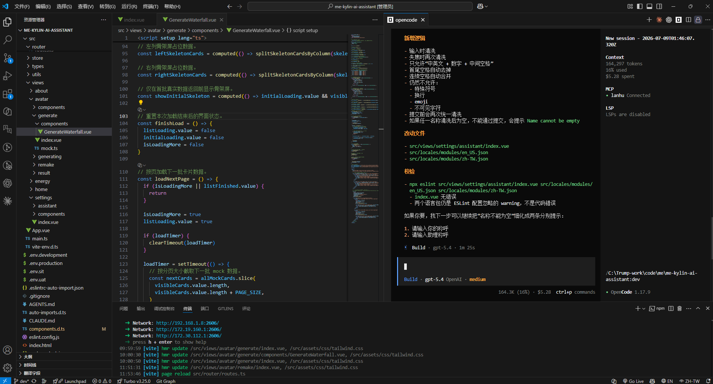

目前主流的 Agent 工具：

| 工具            | 类型 | 本地模型              | MCP | 适合场景                                     |
| --------------- | ---- | --------------------- | --- | -------------------------------------------- |
| **Claude Code** | 商业 | ❌                    | ✅  | 综合能力最强，复杂项目（国内用户可能不友好） |
| **Codex**       | 开源 | ❌（可接 OpenAI API） | ✅  | OpenAI 生态、终端开发、自动化编码            |
| **OpenCode**    | 开源 | ✅                    | ✅  | 被称为开源的 Claude Code，支持多模型         |
| **Roo Code**    | 开源 | ✅                    | ✅  | VS Code 重度用户                             |
| **Cline**       | 开源 | ✅                    | ✅  | 自动执行命令、代码修改                       |

## CC Switch

### 什么是 CC Switch？

CC Switch 是一款跨平台桌面应用，专为使用 AI 编程工具的开发者设计。它帮助你统一管理 Claude Code、Codex、Gemini CLI、OpenCode 等应用的配置。

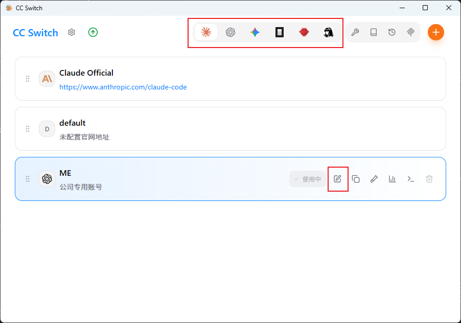

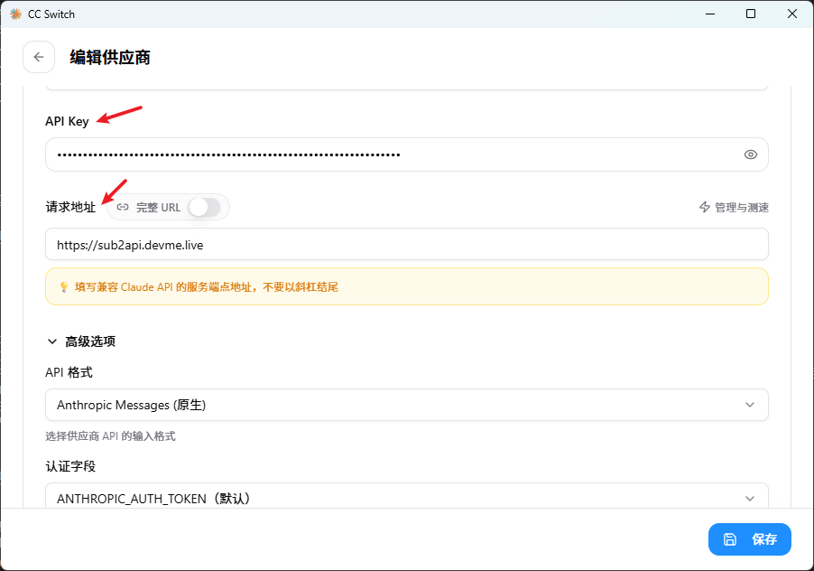

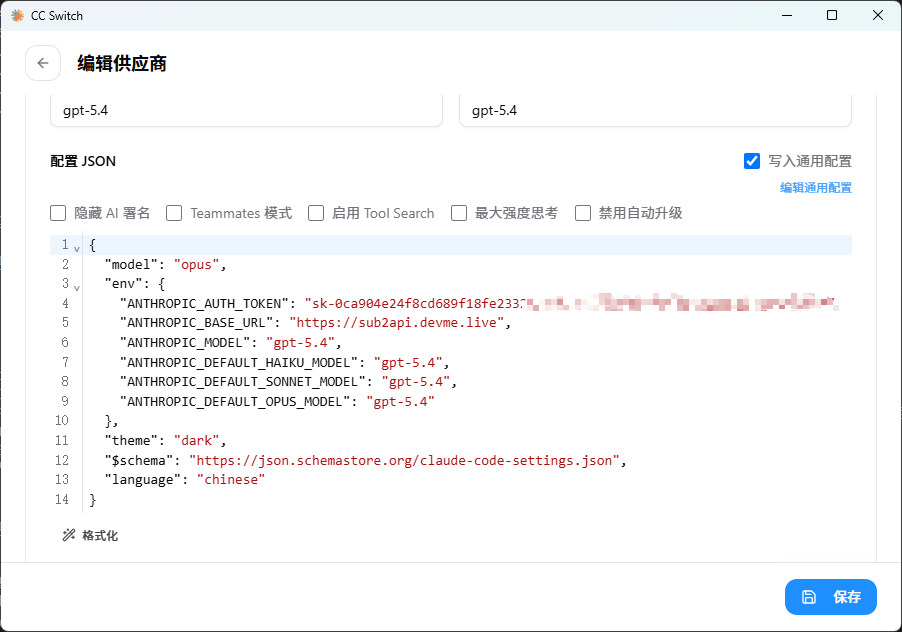

## Agent 四层架构模型

可以将 Agent 的能力理解为四层：

1. 记忆层：通过配置文件沉淀长期规则与项目背景。
2. 扩展层：通过命令、技能、子智能体、Hooks 等机制扩展执行能力。
3. 集成层：通过 MCP 等协议连接外部工具、数据库与 API。
4. 编程层：通过 Agent SDK 编排更复杂的自动化工作流。

围绕这四层，常见能力可以这样理解：

- AGENT.md（记忆系统）：将项目规范一次性写入配置文件，即可在每次会话中自动加载，不需要反复重申。
- Skills：解决风格漂忽问题，将代码审查标准配置化、制度化，尽量减少“口头叮嘱”的不确定性。（例如 Superpowers：让 Agent 在写代码之前先进行需求澄清、设计评审、制定计划，然后逐步执行。）
- 子智能体：化解上下文溢出，将涉及多个文件的重构任务拆解为多个独立的上下文单元，实现并行处理与逻辑隔离。
- Hooks：在工具调用时自动触发安全检查或日志记录，构建防御性编程机制。
- MCP（Model Context Protocol，模型上下文协议）：赋予 Agent 调用外部数据库与 API 的能力。（例如蓝湖 MCP）
- Headless 模式：支持在 CI/CD 流水线中“无人值守”运行，实现真正的自动化交付。（例如合并代码到某个分支后自动发布）
- Agent SDK：允许通过代码编排复杂的多步 Agent 工作流，提升任务执行的灵活性。
- Plugins 生态：将上述能力打包封装，便于在团队内部高效分发与复用。

图例：

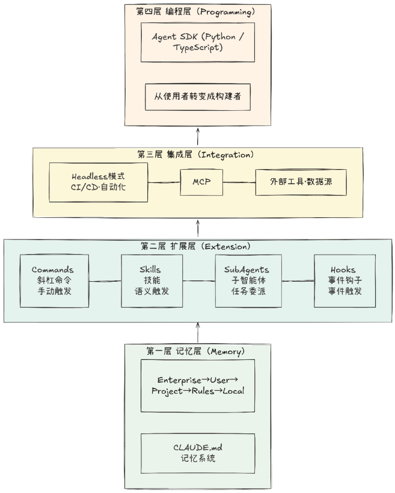

这四层架构可以生动地比作一栋摩天大楼。

- 记忆层好比深埋地下的地基。若无此根基，其上的一切构建都将无从谈起，随时面临坍塌风险。
- 扩展层的 Commands、Skills、SubAgents、Hooks 共同构成了建筑的主体楼层，承载着日常运行的核心功能，也是用户最直接感知的价值空间。
- 集成层宛如隐藏却至关重要的水电管网，它将这座建筑与外部广阔的基础设施网络紧密相连，确保持续的能量与信息流动。
- 编程层的 Agent SDK 则像位于顶楼的建筑师工作室。在这里，你不再只是住户，而是拥有设计全新建筑、重构空间逻辑的“至高权力”。

自下而上审视，这是构建视角，关注基石与支撑；自上而下俯瞰，则是使用视角，聚焦功能与体验。

## AGENT.md

AGENT.md 本质上是一份“给 AI 的员工手册”，能在每次对话启动时自动加载到 Agent 的上下文中。

不同工具中的文件名可能略有差异，例如 `AGENT.md`、`CLAUDE.md`，但其核心目的相同：让 Agent 在会话开始前先了解团队规则、项目背景和工作方式。

每当开启新对话时，Agent 对项目背景、技术栈选择、代码规范及团队约定往往一无所知。若未进行任何配置，开发者就需要反复重申诸如“使用 TypeScript 而非 JavaScript”“优先选用 pnpm 而非 npm”“测试框架定为 Vitest”等基础设定。这种如同新员工入职般重复自我介绍的模式，低效程度可想而知。

记忆层通过 AGENT.md 彻底解决了这一痛点。

更为精妙的是，Agent 的这种记忆机制通常会构建一个分层记忆体系（见下图），每一级均对应不同的适用范围。

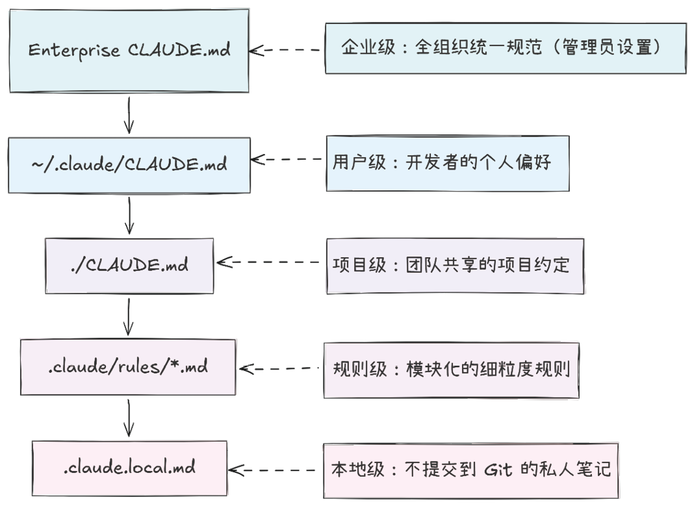

这种分级设计背后的工程思想，与 CSS 的层叠优先级机制，或软件配置中“全局 - 用户 - 项目 - 本地”的覆盖模式如出一辙：每一级都可以覆盖上一级的设定，而层级越具体，其优先级越高。

一个典型的项目级 AGENT.md 示例：

```md
# 项目记忆 AGENT.md

## 技术栈

- 语言：TypeScript 5.x（启用严格模式）
- 框架：Nuxt 4 + Vue 3（组合式 API 风格）
- 状态管理：Pinia（禁用 Vuex）
- 测试：Vitest + Vue Test Utils（所有可导出函数与组件必须包含单元测试）
- 包管理：pnpm（禁用 npm 或 yarn）

## 代码规范

- 组件风格：仅使用 `<script setup>` 函数式组件，禁止 Options API 和 class 组件
- 错误处理：业务逻辑层统一返回 `Result<T, E>` 类型（自定义 Result 工具），严禁在非边界处直接 throw 异常
- 路由与页面：使用 Nuxt 文件系统路由，避免手动注册路由
- 提交规范：遵循 Conventional Commits 格式 - `<type>[optional scope]: <description>`
  （示例：`feat(auth): add login with QR code`）

## 常用命令

- `pnpm dev` - 启动开发服务器（默认端口 3000）
- `pnpm build` - 构建生产版本
- `pnpm preview` - 预览构建产物
- `pnpm test` - 运行 Vitest 单元测试
- `pnpm lint` - 执行 ESLint + Prettier 代码检查
- `pnpm lint:fix` - 自动修复可修复的 lint 问题
```

基于 AGENT.md，Agent 在每次开启对话时便会自动“研读手册”，从而避免技术栈误用与代码风格漂忽的风险。正如有人所说：“自从创建了 AGENT.md，我再也不必在每次对话中反复强调‘我们使用 pnpm，而不使用 npm’了。”

## Skills

Skills 是一个基于 AGENT.md 的技能系统，用来减少风格漂忽，并将代码审查标准配置化、制度化，尽量取代“口头叮嘱”的不确定性。

在很多 Agent 体系中，Skills 不一定需要用户手动触发，而是由 Agent 根据当前任务的语义上下文，自动研判并加载相应技能。

每个 Skill 本质上是一个包含 `SKILL.md` 的目录。在该文件中，通常通过 YAML Frontmatter（前置元数据）声明 Skill 的名称、描述及允许调用的工具列表。Agent 正是依据 `description` 字段的内容，动态决策“当前任务是否需要激活此 Skill”。

以下是一个典型的 `SKILL.md` 示例：

```yaml
---
# 代码审查
name: code-reviewing
# 审查代码以了解最佳实践和潜在问题。当用户要求代码审查或提及时使用审查变更。
description: >
  Review code for best practices and potential issues.
  Use when the user asks for code review or mentions
  reviewing changes.
allowed-tools:
  - Read
  - Grep
  - Glob
---
# Code Review Guidelines
你是一名专业的代码审查员……
```

## 子智能体

子智能体解决的是另一个更深层次的瓶颈：上下文窗口的有限性。

它的策略是为特定子任务开辟独立的上下文空间，如同在主工作台旁增设一张专用工位，指派专人专注处理局部问题。

这类似于管理者委派任务：无需深究每一行代码或每一步推导，只需接收清晰的结论与可操作的建议，从而在更高层级上高效决策与协调。

你还可以为子智能体设置严格的工具权限，例如规定“代码审查员”仅拥有读取文件的权限，严禁修改任何内容。

## Hooks

Hooks 是具备“拦截”能力的模块，和 Git Hooks 类似。

如果说 Skills 指导了 Agent “怎么做”，那么 Hooks 则进一步决定 Agent “能不能做”。

例如：每当 Agent 试图执行 `git commit` 时，自动运行 lint 检查；如果检查未通过，则直接阻止提交操作。这种“隐形守卫”的角色，使 Hooks 成为保障代码质量与安全合规的利器。

以下是一个典型配置示例：

```json
{
  "hooks": {
    "PreToolUse": [
      {
        "matcher": "Bash",
        "command": "python .claude/hooks/safety_check.py",
        "blocking": true
      }
    ]
  }
}
```

上述配置的含义是：每当 Agent 准备调用 Bash 工具执行命令时，系统会优先运行安全检查脚本；如果脚本返回检查失败，此次调用将被强制阻断。

无论是 Git Hooks，还是数据库触发器，其本质都遵循统一模式：在特定事件发生时，自动执行预设逻辑。

## MCP

MCP 负责连接外部世界，它赋予 Agent 与外部工具及数据源深度交互的能力，例如：上次分享的蓝湖 MCP。

以下是一个典型配置示例：

```json
"mcp": {
  "lanhu": {
    "type": "remote",
    "url": "http://192.168.1.68:xxx/mcp?role=Developer&name=xxx",
    "enabled": true
  }
}
```

## Agent 处理流程图

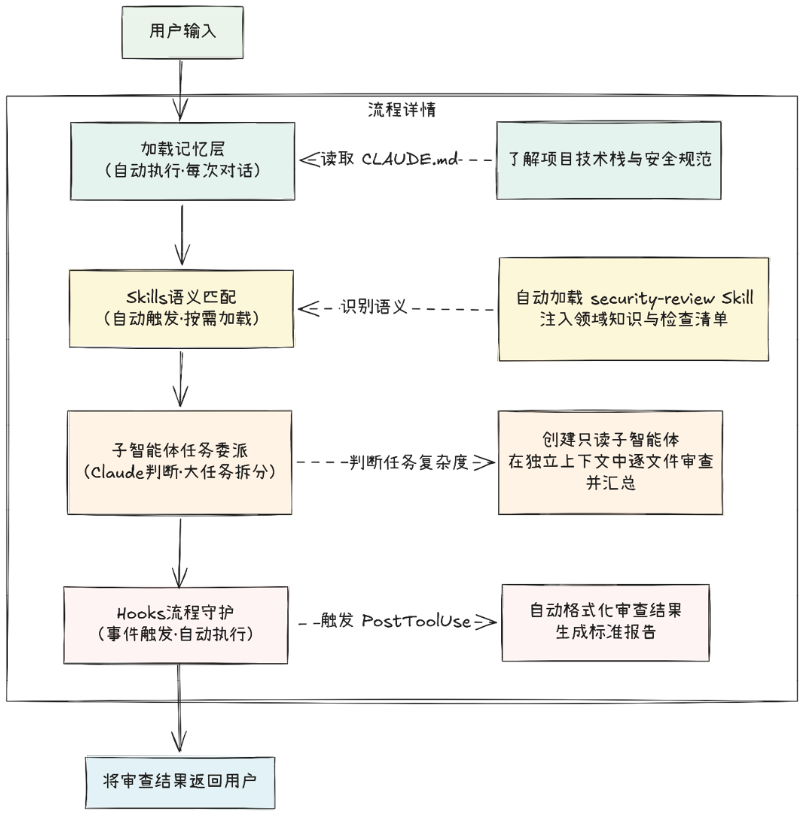

## Agent SDK

摩天大楼的顶楼是建筑师的工作室。在这里，你不再是大楼的住户，而是设计新蓝图的创造者。

对于绝大多数开发者而言，前三层（记忆层、扩展层、集成层）足以应对日常开发场景。

然而，如果你的愿景是构建团队级 AI 开发平台，或者设计多 Agent 协作的自动化系统，那么 Agent SDK 便是必经之路。

## Plugins（插件）

它将一套完整的 Agent 能力打包成可一键安装的单元。就像 npm 之于 JavaScript 生态、pip 之于 Python 生态一样，Plugins 是 Agent 能力的标准化分发机制。

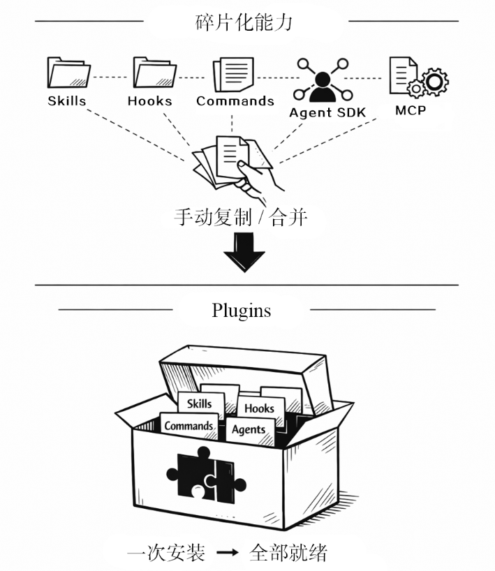

当你耗费数周为团队打磨出一套完整的开发工作流，并试图将其分享给另一团队时，现实却令人却步：

- Skills 需要复制至.claude/skills/目录
- Hooks 配置需要合并入 settings.json
- MCP 服务器需要单独配置
- 自定义命令需要移至.claude/commands/
- 子智能体定义又散落在其他位置

接收方不仅必须逐一理清每个组件的安装步骤，还需要应对潜在的命名冲突。

Plugins 本身并不引入新的功能，而是提供了一套统一的打包格式和安装机制。

一个 Plugin 能够同时囊括 Skills、Hooks、Commands、Agents 以及 MCP 配置，只需要一行命令即可让所有组件就位。/plugin install ./path/react-workflow

Plugin 目录结构示例（以 Claude Code 为例）：

```Stylus
react-workflow/                         ← Plugin根目录
├── .claude-plugin/
│   └── plugin.json                     ← [必需]Plugin清单文件
├── commands/                           ← 斜杠命令定义
│   ├── review.md                       # 代码审查命令定义
│   └── deploy.md                       # 测试运行命令定义
├── agents/                             ← 子智能体定义
│   ├── security-scanner.md             # 安全扫描子智能体配置
│   └── quick-fix.md                    # 快速修复子智能体配置
├── skills/                             ← Skills领域知识包
│   └── react-patterns/
│       ├── SKILL.md                    # React 最佳实践知识库
│       └── chapters/
│           ├── hooks.md
│           └── performance.md
├── hooks/                              ← Hooks配置与脚本
│   ├── hooks.json                      # Hook触发配置
│   ├── check-bash.sh                   # Bash命令安全检查脚本
│   └── auto-format.sh                  # 自动格式化执行脚本
├── .mcp.json                           ← MCP服务器配置引用
└── README.md                           ← 文档说明
```

### 从社区市场安装（从官方或认证的社区仓库拉取已发布的 Plugin 包）

/plugin install react-workflow@community


### 从 GitHub 仓库安装

/plugin install github.com/username/react-workflow


### 从本地目录安装（适用场景：Plugin 开发调试阶段，修改代码后无需重新发布即可实时测试）

/plugin install ./path/to/my-plugin

## 最后：写好 AGENT.md 与 Prompt 提示词

“同样的任务，为什么有人能让 Agent 一次出完美答案，我却要来回改好几遍？​”

答案通常不在于 Agent 的能力差异，而在于指令的质量。优秀的指令如同一份完美的需求文档：清晰、具体、无歧义。

### AGENT.md 编写原则

AGENT.md 是 Agent 中最核心的配置文件。
实测数据显示，优化该文件可带来 5%以上的通用编码性能提升，在特定仓库中增幅甚至可达 11%。

建议包含以下内容。

- 关键命令：构建、测试及部署的具体指令 ​。
- 定制规范：与默认设置不同的代码风格规则。
- 架构约束：项目特有的架构决策与设计限制。
- 环境要求：开发环境的特殊配置（如必需的环境变量、非标准工具链等）​。
- 避坑指南：常见陷阱及不易察觉的系统行为。应避免以下内容。
- 可推导信息：Agent 通过阅读代码即可自行推断的内容。
- 通用惯例：标准的语言规范（Agent 已内置相关知识）​。
- 易变信息：频繁变动的内容（此类信息会导致缓存失效）​。
- 文件详述：文件的代码描述（应交由@搜索工具处理）​。
- 空泛建议：如“编写整洁代码”等不言自明的原则。

### 精准表达技巧

指令的核心在于以最小的 Token 消耗传达最完整的信息。以下是 3 个实用技巧。

#### 1 量化一切

避免模糊描述，务必使用具体数据，如“处理大量数据”可写作“处理 100 万条记录”​，​“响应要快”可写作“P99 响应时间< 200 ms”​，​“代码要简洁”可写作“函数不超过 20 行，参数不超过 4 个”​。

#### 2 示例驱动

对于复杂需求，一个示例胜过 10 句描述。

```js
需求：将蛇形命名转换为驼峰命名
　
示例：
输入： "get_user_name" → 输出： "getUserName"
输入： "http_request"  → 输出： "HTTPRequest"
```

#### 3 明确边界

定义“禁止项”与定义“执行项”同等重要，要防止 Claude 越界。

```js
范围限制：仅修改auth模块，严禁触碰其他文件。
工具约束：必须使用项目现有的logger，禁止使用console.log。
依赖管理：严禁添加任何新依赖。
失败处理：若遇到无法解决的问题，请立即报告并停止操作，切勿反复尝试。
```

目前常见的UI界面基本可以100%还原，不需要修改一行代码，只要你的提示词足够清晰，边界足够明确。

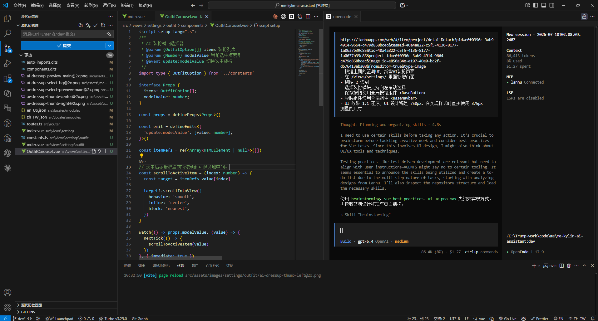
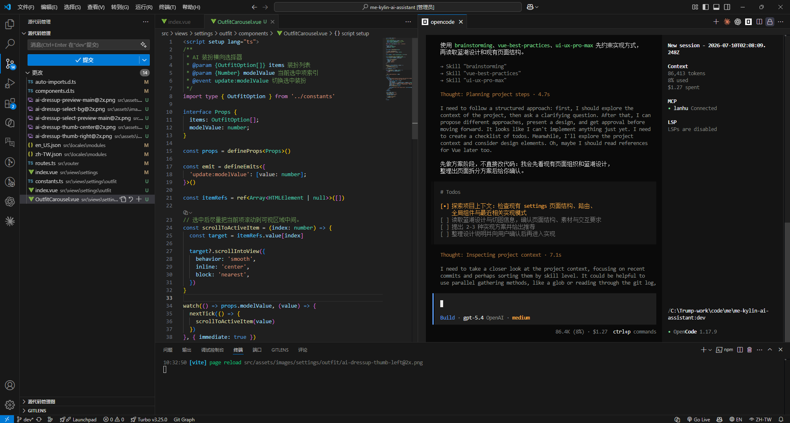
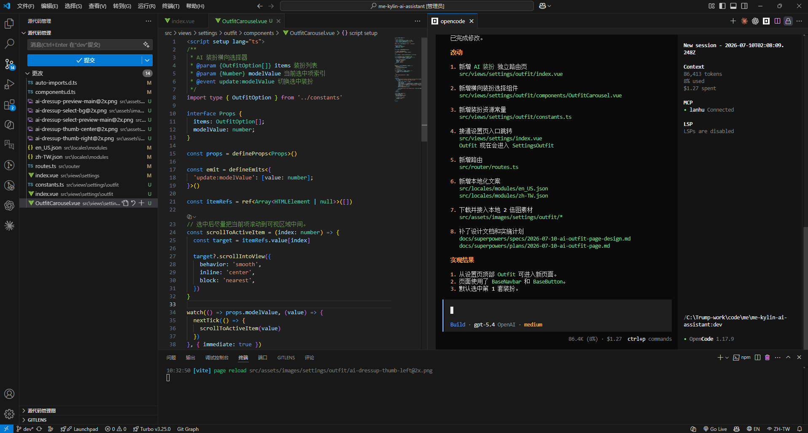