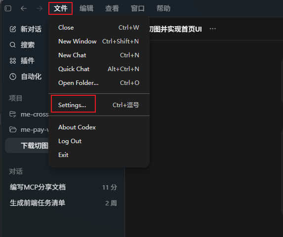
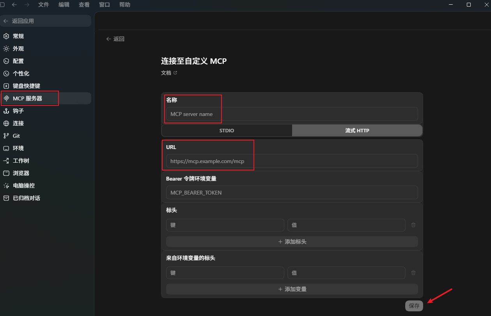
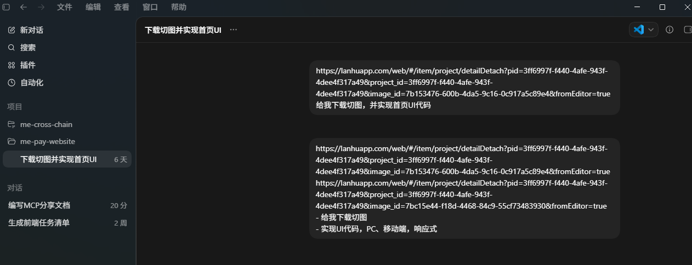

# MCP 使用分享文档

## 1. 什么是 MCP

MCP，`Model Context Protocol`，可以理解为大模型连接外部工具和数据的标准协议。

它解决的核心问题是：**让模型用统一方式访问文件、数据库、设计平台、浏览器、企业系统等外部能力**，而不是每个客户端、每个工具都各搞一套接入方式。

一句话概括：

**MCP 不是让模型更聪明，而是让模型真正接入业务系统。**

## 2. MCP 的核心组成

MCP 可以简单理解成三层：

- `Host`：承载 AI 的宿主应用，例如 AI IDE、桌面客户端、Agent 平台。
- `Client`：Host 内部的协议实现，用来连接 MCP Server。
- `Server`：能力提供方，把工具、资源、提示模板暴露给模型。

MCP 里最常见的三类能力：

- `Tools`：可调用的函数，例如查 Bug、读文件、开浏览器。
- `Resources`：可读取的资源，例如文档、代码文件、设计稿。
- `Prompts`：可复用的提示模板，例如代码评审模板、发布检查模板。

## 3. 常见的 MCP 有哪些

常见 MCP，本质上是常见的 MCP Server 类型：

- 文件系统类：读取代码、配置、日志。
- Git / GitHub / GitLab 类：查看提交、PR、Issue、diff。
- 数据库类：查询表结构、只读查询数据。
- 浏览器自动化类：打开页面、点击、截图、检查 DOM。
- 文档知识库类：查询规范、接口文档、产品文档。
- 设计平台类：读取设计稿、尺寸、文案、切图信息。
- 项目管理类：查询 Jira、禅道、任务和 Bug。
- 企业内部系统类：接用户中心、订单系统、监控平台、发布平台。

如果面向研发团队，最实用的通常是：

- 文件系统
- Git
- 浏览器自动化
- 文档知识库
- 设计平台

## 4. MCP Server 如何部署

MCP Server 常见两种部署方式。

### 4.1 本地部署

适合本地工具型能力，例如：

- 文件系统
- 本地代码仓库
- 本地浏览器自动化
- 本地脚本工具

常见做法：

- 用 Node.js 或 Python 启动一个本地进程
- 客户端通过 `stdio` 和它通信

优点：

- 接入简单
- 适合个人开发环境

缺点：

- 不适合多人共享
- 依赖装在开发者本机

### 4.2 远程部署

适合企业统一能力，例如：

- 文档中心
- Bug 平台
- 发布平台
- 内部业务系统

常见做法：

- 部署为 HTTP 服务
- 放到容器或 Kubernetes
- 通过网关做认证、限流和审计

优点：

- 多人共享
- 统一维护和治理

缺点：

- 部署复杂度更高
- 需要处理安全和权限问题

## 5. 部署 MCP Server 的基本步骤

一个 MCP Server 的落地过程，通常是：

1. 先定义能力边界  
   明确暴露什么能力，哪些只读，哪些高风险。

2. 定义工具接口  
   名称清晰、参数明确、输入输出结构化。

3. 实现业务逻辑  
   做好参数校验、权限校验、超时控制和错误处理。

4. 接入客户端  
   本地模式一般配置启动命令，远程模式一般配置服务地址和认证方式。

5. 增加治理能力  
   至少补齐日志、审计、限流、敏感数据脱敏。

落地原则很重要：

- 先从只读场景开始
- 先做高频低风险能力
- 不要默认开放高权限写操作

## 6. WEB 前端开发中的实际应用

MCP 对 Web 前端最有价值的地方，不是“自动写代码”，而是把设计、代码、文档、浏览器和项目系统打通。

### 6.1 设计稿转页面骨架

设计平台 MCP 读取设计稿信息，模型结合项目组件规范生成页面初稿。

价值：

- 减少手工抄设计稿
- 降低尺寸、颜色、文案抄错概率
- 提高页面初稿产出速度

### 6.2 浏览器联动调试

文件系统 MCP 读代码，浏览器 MCP 打开本地页面，检查 DOM、样式、控制台报错，再回写代码继续验证。

价值：

- 自动做冒烟测试
- 自动检查表单和交互流程
- 更快定位前端页面问题

### 6.3 接口联调助手

文档类 MCP 读取接口文档，代码类 MCP 读取请求封装和页面代码，模型自动比对字段和状态处理逻辑。

能发现的问题：

- 参数名不一致
- 字段类型不一致
- 空态、异常态漏处理
- 分页或状态码理解错误

### 6.4 组件库智能问答

把团队组件库封装成 MCP Server，模型可以直接查询：

- 组件用法
- props 定义
- 最佳实践
- 已知限制

这样生成的前端代码会更贴近团队规范，而不是靠模型猜。

### 6.5 Bug 定位与回归分析

通过 Bug 平台 MCP、Git MCP、浏览器 MCP、日志或监控 MCP 组合，模型可以辅助完成：

- 读取 Bug 描述
- 找相关提交
- 复现问题
- 分析高概率根因
- 给出修复建议

## 7. 前端团队推荐的第一批 MCP

如果是前端团队落地，建议第一阶段先接这几类：

1. 文件系统 MCP
2. Git / 仓库 MCP
3. 浏览器自动化 MCP
4. 文档 / 知识库 MCP
5. 设计平台 MCP

这套组合已经能覆盖大部分高频工作：

- 看设计
- 写页面
- 联调接口
- 查规范
- 跑回归
- 查历史修改

## 8. 落地时的注意点

最常见的几个误区：

- 把 MCP 当成万能自动化工具
- 一开始就接生产高权限能力
- 输入输出不结构化
- 没有权限控制和调用审计

更稳妥的做法是：

- 先只读，后写入
- 先单点提效，后全链路自动化
- 把权限和敏感数据控制放在 Server 侧

## 9. 总结

MCP 的本质，是为大模型访问外部能力建立统一接口标准。

对 Web 前端来说，它最直接的价值是把：

- 设计稿
- 代码仓库
- 浏览器
- 文档系统
- 需求和 Bug 平台

连接到同一套 AI 工作流里，让模型从“会回答问题”变成“能参与研发交付”。

## 10. 参考资料

- MCP 官方首页：[https://modelcontextprotocol.io/introduction](https://modelcontextprotocol.io/introduction)
- MCP Architecture：[https://modelcontextprotocol.io/docs/learn/architecture](https://modelcontextprotocol.io/docs/learn/architecture)
- MCP Server Quickstart：[https://modelcontextprotocol.io/quickstart/server](https://modelcontextprotocol.io/quickstart/server)
- 官方 TypeScript SDK：[https://github.com/modelcontextprotocol/typescript-sdk](https://github.com/modelcontextprotocol/typescript-sdk)
- 官方 Servers 仓库：[https://github.com/modelcontextprotocol/servers](https://github.com/modelcontextprotocol/servers)

## 11. MCP 项目应用

### 1. 部署 MCP 服务

git 开源蓝湖 MPC : https://github.com/dsphper/lanhu-mcp

- 智能需求分析：自动提取 Axure 原型，三种分析模式（开发/测试/探索），需求分析准确率>95%
- 团队知识库：打破 AI IDE 孤岛，让所有 AI 助手共享知识库和上下文
- UI设计支持：自动下载设计稿，智能提取切图，语义化命名；设计图分析可获取尺寸/间距/颜色/字体等精确参数，并得到转换后的 HTML+CSS 代码参考
- 性能优化：基于版本号的智能缓存，增量更新，并发处理

可以按照 README.md 的步骤，在本地部署 MCP 服务。

### 2. 给 Agent 添加 MCP 服务

这里以 Codex 为例：

点击文件 -> 设置 -> 添加 MCP 服务器 -> 输入 MCP 服务器的名称、地址 -> 保存






### 3. 使用 MCP 服务，自动切图，生成对应的 UI 代码

- 前提，需要将 WEB 框架搭建好，例如： Nuxt4 + Vue3 构建 SSG 多页面应用（非服务端渲染）
- 使用 Agent /init ，让 Agent 获取项目信息
- 这时候就可以开始使用 MCP 服务了

```text
https://lanhuapp.com/web/#/item/project/detailDetach?pid=3ff6997f-f440-4afe-943f-4dee4f317a49&project_id=3ff6997f-f440-4afe-943f-4dee4f317a49&image_id=7b153476-600b-4da5-9c16-0c917a5c89e4&fromEditor=true
https://lanhuapp.com/web/#/item/project/detailDetach?pid=3ff6997f-f440-4afe-943f-4dee4f317a49&project_id=3ff6997f-f440-4afe-943f-4dee4f317a49&image_id=7bc15e44-f18d-4468-84c9-55cf73483930&fromEditor=true
- 给我下载切图，下载 webp 2倍图
- 实现UI代码，PC、移动端，响应式
```



MCP 能自动下载设计稿中的切图，并生成对应的 UI 代码。  
所有图片将按规范自动保存至 `/assets/images/home` 目录，并采用统一命名规则。

对于生成结果中偶有缺失或不够精准的细节，可交由 MCP 自动修正，或进行少量手动微调。

**效果显著：MCP 大幅提升了 UI 代码的开发效率。**  
**长远目标：让前端开发者无需手写 UI 代码——一切由 MCP 自动生成。**

以后台管理系统为例，大量 UI 代码（如页面布局、组件结构等）完全可以交由 Agent 自动生成。

像以下这类重复性细节问题，也无需人工逐一手动调整：
- 路由标签左右 padding 区域点击无法跳转  
- 刷新/关闭按钮缺少 hover 反馈效果  
- 标签交互状态不一致等

这些琐碎但必要的优化，Agent 均可自动识别并修复。

开发者从此得以聚焦更高价值的工作：  
**项目架构设计、业务逻辑实现与系统可维护性。**

-----------------------

## 最后
今后的分享，请尽量结合实际工作场景，避免通篇纯文字讲解，以免听众注意力分散甚至“犯困”。

建议采用 “理论 + 实例 + 截图” 的方式：

用简明语言讲清核心观点；
配合真实工作案例说明如何落地；
必要时附上系统界面、流程图或数据截图，让内容更直观、易懂。

能实践的理论才有价值，有例子的分享才真正有用。

最后的最后，每天需要有人在