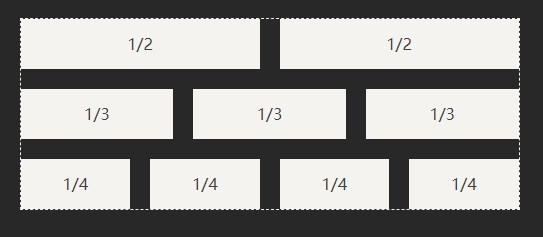
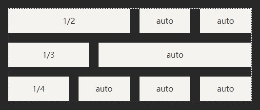
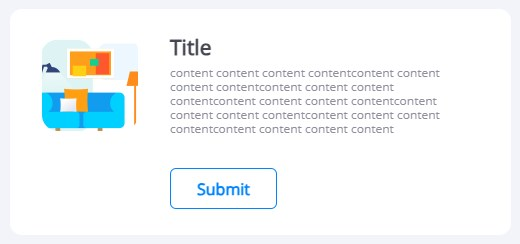
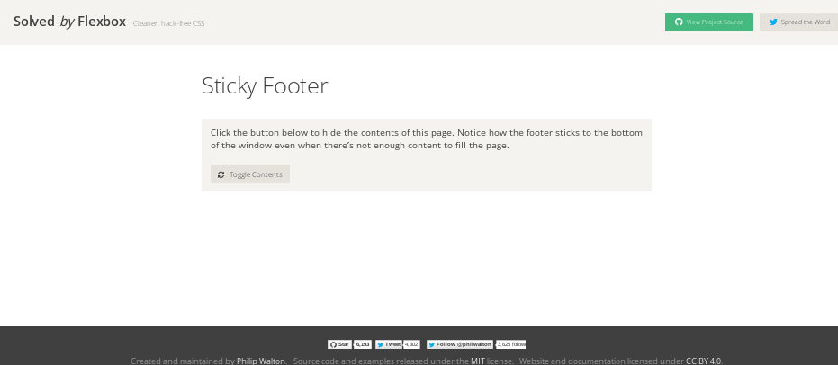
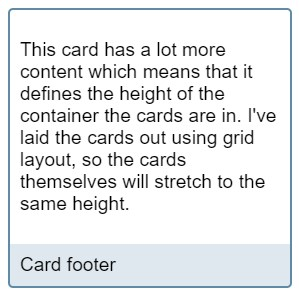

# Flex 布局实例

## 1. 网格布局

### 基本网格布局

最简单的网格布局，就是平均分布。在容器里面平均分配空间。



HTML代码：

```html
<div class="grid">
  <div class="grid-cell">...</div>
  <div class="grid-cell">...</div>
  <div class="grid-cell">...</div>
</div>
```

CSS代码：

```css
.grid {
  display: flex;
}
.grid-cell {
  flex: 1;
}
```

### 百分比布局

某个网格宽度为固定值或者固定百分比，其余网格平均分配剩余的空间。



HTML代码：

```html
<div class="grid">
  <div class="grid-cell u-col-2">...</div>
  <div class="grid-cell">...</div>
  <div class="grid-cell">...</div>
</div>
```

CSS代码：

```css
.grid {
  display: flex;
}
.grid-cell {
  flex: 1;
}
.u-col-2 {
  flex: 0 0 50%;
}
.u-col-3 {
  flex: 0 0 33.3333%;
}
.u-col-4 {
  flex: 0 0 25%;
}
```

## 2. 表单控件

我们经常需要在输入框前方添加提示，后方添加按钮。


## 3. 媒体对象

媒体对象是网页设计中的常见模式：这种模式下，一侧具有图片或其他元素，另一侧具有文本。



CSS代码：

```css
.media {
  display: flex;
  gap: 20px;
  align-items: flex-start;
}
```

## 4. 固定页脚
有时，页面内容太少，无法占满一屏的高度，底栏就会抬高到页面的中间。这时可以采用Flex布局，让底栏总是出现在页面的底部。



HTML代码：

```html
<div class="page">
  <header></header>
  <main class="content"></main>
  <footer></footer>
</div>
```

CSS代码：

```css
.page {
  display: flex;
  flex-direction: column;
  min-height: 100vh;
}
.content {
  flex: 1;
}
```

卡片底部固定也是一样的原理



## 5. 圣杯布局
https://juejin.cn/post/6964252709130240030

## 6. 流式布局

## 7. 左边元素和右边元素等高（右边元素高度不固定） css 题
