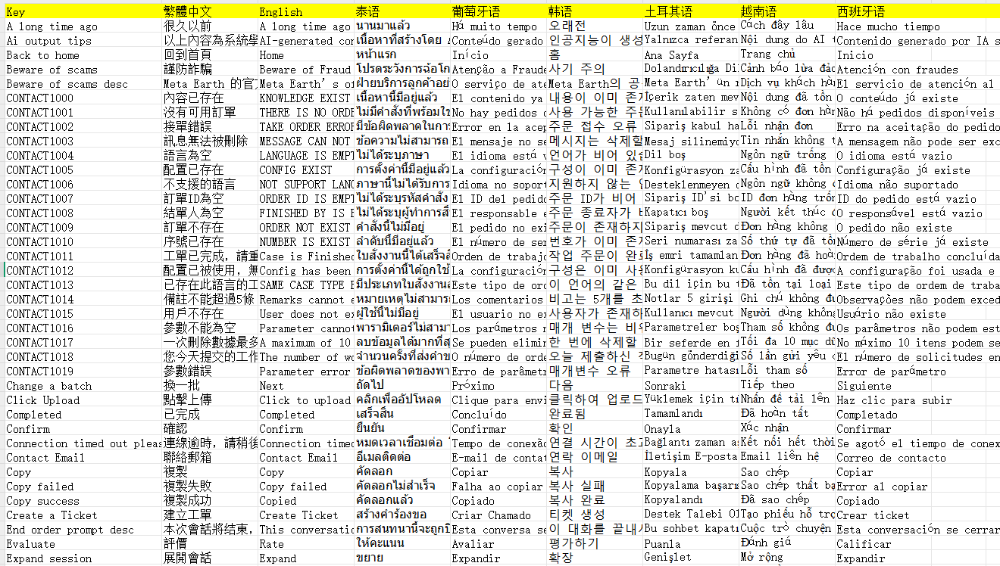

# 将项目国际化配置文件导出成 excel

## 需求：

1. 将项目国际化配置文件导出成 excel，交给产品效对国际化文案；
2. 产品将校对后的 excel 发回。将 excel 和项目国际化文件对比，相同的 key，使用 excel 的值覆盖，输出新的国际化配置文件。

## 工具选择

使用 Node.js 实现文件读写

## 1. 初始化项目

在新创建的目录中初始化一个新的 Node.js 项目。这将创建一个 package.json 文件，用于记录项目的元数据以及依赖关系。

```bash
npm init -y
```

-y 是一个选项，表示“yes”或“同意所有默认值”。当你运行 npm init -y 时，它会自动为你创建一个 package.json 文件，并使用一组默认值填充这个文件。

```json
{
  "name": "demo",
  "version": "1.0.0",
  "description": "",
  "type": "module", // 手动配置
  "main": "index.js",
  "scripts": {
    "test": "echo \"Error: no test specified\" && exit 1"
  },
  "keywords": [],
  "author": "",
  "license": "ISC"
}
```

在 package.json 加入 "type": "module"

"type": "module" 会使得 Node.js 将该目录下的所有 .js 文件视为 ES 模块（ESM），而不是传统的 CommonJS 模块。

这意味着你可以直接在 .js 文件中使用 import 和 export 语句，而不需要将文件扩展名为 .mjs

## 2. 安装必要的依赖

安装必要的依赖包。我们需要安装 xlsx。

```bash
npm i xlsx
```

xlsx 用于在浏览器和 Node.js 环境中读取、写入和操作 Excel 文件（包括 .xlsx、.xls、.csv 等格式）。

## 3. 编写代码

```
├──scripts
  ├──export-to-excel
    ├──locales
      ├──en_US.json
      ├──zh-TW.json
      ├── ...
    ├──index.js
```

### 导出预期结果：



### 思路分析

1. 读取原始国际化文件（如: zh.json, en.json）
   ↓
2. 解析 JSON，提取 key-value 结构
   ↓
3. 将多语言数据合并成二维表格（Excel 表格）
   ↓
4. 导出为 .xlsx 文件（供产品校对）

5. 定义语言映射表（可自定义表格头）

```js
// 语言文件映射：文件名 -> 列头显示名（可自定义）
const languageFiles = {
  'zh-TW.json': '繁體中文',
  'en_US.json': 'English',
  'th_TH.json': '泰语',
  'pt_PT.json': '葡萄牙语',
  'ko_KR.json': '韩语',
  'tr_TR.json': '土耳其语',
  'vi_VN.json': '越南语',
  'es_ES.json': '西班牙语'
}
```

2. 定义数据映射，读取所有语言文件，将所有语言的翻译按 key 汇总到 dataMap 中

```json
// 存储所有数据，格式：{ key: { 'zh-TW': value, 'en-US': value, ... } }
// const dataMap = {}
{
  "A long time ago": {
    "zh-TW": "很久以前",
    "en-US": "A long time ago",
    "th-TH": "นานมาแล้ว",
    "pt-PT": "Há muito tempo",
    "ko-KR": "오래전",
    "tr-TR": "Uzun zaman önce",
    "vi-VN": "Cách đây lâu",
    "es-ES": "Hace mucho tiempo"
  },
  "Ai output tips": {
    "zh-TW": "以上內容為系統學習相關知識後生成，僅供參考",
    "en-US": "AI-generated content for reference only",
    "th-TH": "เนื้อหาที่สร้างโดย AI ใช้เพื่อการอ้างอิงเท่านั้น",
    "pt-PT": "Conteúdo gerado por IA apenas para referência",
    "ko-KR": "인공지능이 생성한 참고용 내용입니다",
    "tr-TR": "Yalnızca referans amaçlı AI tarafından oluşturulmuş içerik",
    "vi-VN": "Nội dung do AI tạo chỉ để tham khảo",
    "es-ES": "Contenido generado por IA solo como referencia"
  }
}
```

3. 构建二维数组（用于写入 Excel）

```json
// const worksheetData = []
[
  // 二维数组第一项是表头：Key, 繁体中文, English, ...
  [
    "Key",
    "繁體中文",
    "English",
    "泰语",
    "葡萄牙语",
    "韩语",
    "土耳其语",
    "越南语",
    "西班牙语"
  ],
  // 接下来是每行数据
  [
    "A long time ago",
    "很久以前",
    "A long time ago",
    "นานมาแล้ว",
    "Há muito tempo",
    "오래전",
    "Uzun zaman önce",
    "Cách đây lâu",
    "Hace mucho tiempo"
  ],
  [
    "Ai output tips",
    "以上內容為系統學習相關知識後生成，僅供參考",
    "AI-generated content for reference only",
    "เนื้อหาที่สร้างโดย AI ใช้เพื่อการอ้างอิงเท่านั้น",
    "Conteúdo gerado por IA apenas para referência",
    "인공지능이 생성한 참고용 내용입니다",
    "Yalnızca referans amaçlı AI tarafından oluşturulmuş içerik",
    "Nội dung do AI tạo chỉ để tham khảo",
    "Contenido generado por IA solo como referencia"
  ]
]
```

### 完整代码

```js
/**
 * 将项目的所有国际化配置导出成 excel 文件
 *
 * 1. /locales 项目国际化配置文件
 * 2. 导出 excel：
 *  - Excel 第一行为表头: Key, 中文, 英文, ...
 *  - Excel 列顺序可配置: Key, zh-TW, en_US, ...
 */

// fs 是 Node.js 的文件系统模块（File System），用于操作文件和目录
import fs from 'fs'
// path 是 Node.js 的路径处理模块，用于处理和操作文件路径
import path from 'path'
// 在 Node.js 的 ES 模块环境（即使用 import/export 语法）中，__dirname 和 __filename 这两个常用变量不可用
// 所以你需要通过以下方式“手动”获取当前文件的路径信息
import { fileURLToPath } from 'url'
import XLSX from 'xlsx'

// 获取当前目录路径
const __filename = fileURLToPath(import.meta.url)
const __dirname = path.dirname(__filename)

// 配置路径
const LOCALES_DIR = path.resolve(__dirname, 'locales') // 指定国际化文件所在路径
const OUTPUT_FILE = path.resolve(
  __dirname,
  `${new Date().toISOString().slice(0, 10)}_output.xlsx` // 指定输出文件名
)

// 语言文件映射：文件名 -> 列头显示名（可自定义）
const languageFiles = {
  'zh-TW.json': '繁體中文',
  'en_US.json': 'English',
  'th_TH.json': '泰语',
  'pt_PT.json': '葡萄牙语',
  'ko_KR.json': '韩语',
  'tr_TR.json': '土耳其语',
  'vi_VN.json': '越南语',
  'es_ES.json': '西班牙语'
}

// 主函数
async function exportToExcel() {
  console.log('🔄 开始读取语言文件...')

  // 存储所有数据，格式：{ key: { 'zh-TW': value, 'en-US': value, ... } }
  const dataMap = {}

  // 读取每个语言文件
  for (const filename in languageFiles) {
    const filePath = path.join(LOCALES_DIR, filename)
    const langCode = filename.replace('.json', '').replace('_', '-') // en_US -> en-US

    try {
      const raw = await fs.promises.readFile(filePath, 'utf8')
      const json = JSON.parse(raw)

      // 遍历 JSON 中的每一个 key
      for (const key in json) {
        if (!dataMap[key]) {
          dataMap[key] = {}
        }
        dataMap[key][langCode] = String(json[key] || key) // 空值用 key 回退
      }
    } catch (err) {
      console.warn(`⚠️ 无法读取或解析文件: ${filePath}`, err.message)
    }
  }

  // 获取所有 key，并排序，按字母顺序排（i18n Ally 默认也是按字母排序）
  const keys = Object.keys(dataMap).sort()

  // 构建二维数组（用于写入 Excel）
  const worksheetData = []

  // 表头：第一列是 "Key"，后面是各语言标题
  const headers = ['Key', ...Object.values(languageFiles)]
  worksheetData.push(headers)

  // 每一行：key + 各语言翻译
  for (const key of keys) {
    const row = [key]
    for (const langFile in languageFiles) {
      const langCode = langFile.replace('.json', '').replace('_', '-')
      row.push(dataMap[key][langCode] || '')
    }
    worksheetData.push(row)
  }

  // 创建工作簿和工作表
  const workbook = XLSX.utils.book_new()
  const worksheet = XLSX.utils.aoa_to_sheet(worksheetData)

  // 设置固定列宽（可选）
  const columnWidths = headers.map((header, i) => ({
    wch: i === 0 ? 25 : 15 // 第一列宽 25，其他列宽 15
  }))
  worksheet['!cols'] = columnWidths

  // 写入工作簿
  XLSX.utils.book_append_sheet(workbook, worksheet, 'Translations')

  // 输出 Excel 文件
  XLSX.writeFile(workbook, OUTPUT_FILE)

  const languages = Object.keys(languageFiles)
  console.log(`✅ Excel 文件已生成：${OUTPUT_FILE}`)
  console.log(`📊 共导出 ${keys.length} 个 key，${languages.length} 种语言`)
}

// 执行
exportToExcel().catch(console.error)
```

## 总结：

Node.js 是处理前端构建、本地自动化等任务的强大首选平台。

### 为什么 Node.js 适合自动化？

- 前端团队技术栈统一
  - 前端开发者熟悉 JavaScript/TypeScript，无需切换到 Python、Shell 等语言。
  - 可直接使用项目中的工具（如 fs、path、JSON 处理）。
- 强大的生态系统
  - npm 提供海量包：xlsx、glob、chalk、commander、fs-extra 等，开箱即用。
  - 轻松处理 JSON、Excel、文件遍历、HTTP 请求等常见任务。
- 跨平台支持
  - 在 Windows、macOS、Linux 上均可运行，适合团队协作。
- 与现代前端工程无缝集成
  - 可作为 package.json 脚本运行：npm run export。
  - 易于集成到 CI/CD 流程中。
