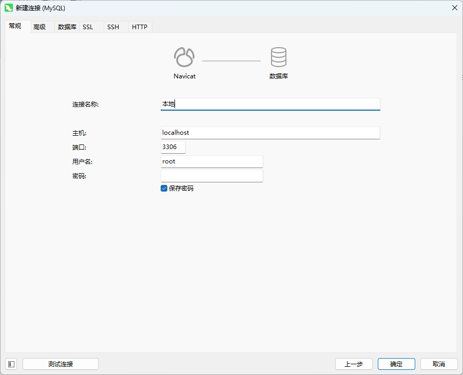
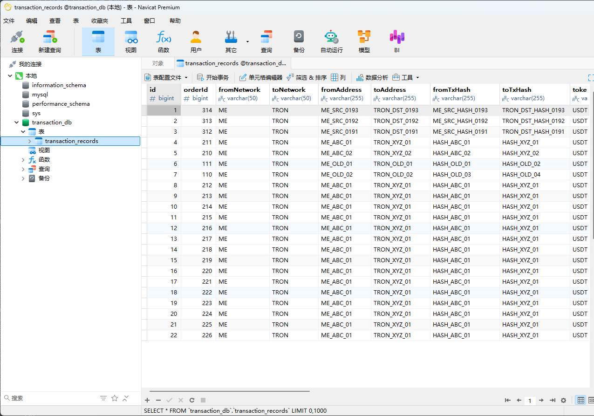

# Node.js 开发后端服务

## 为什么你需要一个 Mock 后端？

在开发联调过程中，你是否经常遇到这些问题？

- 后端接口尚未完成，前端卡住无法推进
- 接口文档虽有，但服务频繁报错或返回异常数据
- 复杂交互页面（如交易记录、筛选、滚动加载）因无真实数据而难以调试

此时，搭建一个本地 Mock 后端，是最高效、最可控的解决方案。

用 MySQL + Node.js 连接数据库 ≠ Mock，而是开发了一个微型真实后端。正常来说简单的 Mock，只需要用 JS 模拟即可。

今天介绍如何使用 Node.js 创建一个完整的后端服务。

一套 **从零开始** 的完整教程：
从 **安装 MySQL → 安装可视化工具 → 创建表结构 → Node.js 连接 → 完整两个接口**。

带你一步步从完全没环境，到接口能跑。

---

# 一、安装 MySQL（Windows）

## **下载 MySQL Community Server**

下载地址（MySQL 官方）：
[https://dev.mysql.com/downloads/mysql/](https://dev.mysql.com/downloads/mysql/)

选择版本：
**MySQL Community Server 8.x**（推荐）

安装步骤（简化版）：

1. 选择 **Server Only** 或 **Developer Default**
2. 设置 root 密码（Aa123456）
3. 安装完毕

---

# 二、安装可视化工具（推荐 Navicat）

“Navicat”是一套可创建多个连接的数据库管理工具，用以方便管理 MySQL、Oracle、PostgreSQL、SQLite、SQL Server、MariaDB、MongoDB 和/或 Redis 等不同类型的数据库，并支持管理某些云数据库，例如阿里云、腾讯云。

## **1️⃣ 下载 Navicat Premium / Navicat for MySQL**

官方下载：
[https://www.navicat.com/en/download/navicat-premium](https://www.navicat.com/en/download/navicat-premium)

安装完成后，你可以用它：

- 创建数据库
- 创建表
- 可视化增删改查
- 导入导出数据
- 测试 SQL

# 三、在 Navicat Premium 中创建数据库

打开 Navicat → 连接 → MySQL：

```
连接名：本地
Host：127.0.0.1
Port：3306
User：root
Password：（你安装时设置的密码）
```

如图：


连接成功以后：

右键连接 → **新建数据库**：
数据库名：`transaction_db`

---

# 四、创建两张数据表（在 Navicat 执行 SQL）

你需要两张表：

### 1️⃣ **记录表：transaction_records**

用于存储每一条交易明细

### 2️⃣ **月份表（可选）：不存在也没关系**

因为我们可以从 `created_at` 自动按月查询，不需要额外表

---

## 执行以下 SQL 创建表

在 Navicat → 选择你的数据库 → 运行 SQL（闪电图标）

```sql
CREATE TABLE `transaction_records` (
  `id` BIGINT PRIMARY KEY AUTO_INCREMENT,
  `amount` DECIMAL(20, 6) NOT NULL,
  `type` VARCHAR(50) NOT NULL,
  `created_at` DATETIME NOT NULL,
  `description` VARCHAR(255) DEFAULT NULL
);
```

数据示例（可直接在 Navicat 可视化输入）：

| id  | amount | type     | created_at          | description |
| --- | ------ | -------- | ------------------- | ----------- |
| 1   | 100    | deposit  | 2025-02-03 12:00:00 | 充值        |
| 2   | -50    | withdraw | 2025-02-10 10:00:00 | 提现        |
| 3   | -30    | withdraw | 2025-03-01 09:00:00 | 提现        |

---

如图：



# 五、Node.js 完整项目演示

# 目录结构

```
project/
│── package.json
│── app.js                              ← 启动文件（路由挂载 + 全局中间件）
│── config/
│     └── db.js                         ← 数据库连接
│── routes/
│     └── transaction.js                ← 路由（接口地址）
│── controllers/
│     └── transactionController.js      ← 处理请求与响应（不写业务）
│── services/
│     └── transactionService.js         ← 数据库操作 + 业务计算
```

---

# Step 1：package.json

> 在项目根目录创建 **package.json**

```json
{
  "name": "transaction-server",
  "version": "1.0.0",
  "description": "Transaction API Service (Node.js + Express + MySQL)",
  "main": "app.js",
  "type": "module",
  "scripts": {
    "start": "node app.js",
    "dev": "nodemon app.js"
  },
  "dependencies": {
    "cors": "^2.8.5",
    "dotenv": "^16.4.0",
    "express": "^4.18.2",
    "mysql2": "^3.9.1"
  },
  "devDependencies": {
    "nodemon": "^3.1.0"
  }
}
```

---

# Step 2：app.js

```js
// 引入 Express 框架
import express from 'express'
// 引入 CORS 中间件，用于处理跨域请求
import cors from 'cors'
// 引入交易相关的路由处理器
import transactionRouter from './routes/transaction.js'

// 创建 Express 应用实例
const app = express()

// 使用 CORS 中间件，允许跨域请求
app.use(cors())

// 使用内置中间件解析 JSON 格式的请求体
app.use(express.json())

// 注册交易相关的 API 路由，所有以 "/user/transactions" 开头的请求都会被 transactionRouter 处理
app.use('/api/user/transactions', transactionRouter)

// 定义服务器监听端口
const PORT = 2525

// 启动服务器并监听指定端口
app.listen(PORT, () => {
  console.log(`🚀 Server running at http://localhost:${PORT}`)
})
```

---

# Step 3：config/db.js（MySQL 连接）

```js
import mysql from 'mysql2/promise'

// 创建 MySQL 连接池配置
// 连接池可以管理多个数据库连接，提高应用性能和资源利用率
const pool = mysql.createPool({
  host: 'localhost', // 数据库服务器地址
  user: 'root', // 数据库用户名
  password: '你的数据库密码', // 数据库密码
  database: 'transaction_db', // 要连接的数据库名称
  connectionLimit: 10 // 连接池最大连接数
})

export default pool
```

---

# Step 4：routes/transaction.js（路由）

路由用来处理 HTTP 请求

```js
import express from 'express'
// 导入控制器，处理请求与响应（不写业务）
import {
  getMonths,
  getRecordsByMonth
} from '../controllers/transactionController.js'

// 创建路由实例
const router = express.Router()

// 获取月份列表
router.get('/months', getMonths)

// 获取某月的交易记录（分页）
router.get('/records', getRecordsByMonth)

export default router
```

---

# Step 5：controllers/transactionController.js（控制器）

控制器处理请求与响应（不写业务）

```js
// 导入 SQL 服务层（数据库操作 + 业务计算）
import {
  fetchMonths,
  fetchRecordsByMonth
} from '../services/transactionService.js'

// 获取月份接口
export const getMonths = async (req, res) => {
  try {
    const months = await fetchMonths()

    res.json({
      code: 200,
      message: 'success',
      data: { months },
      timestamp: Date.now(),
      success: true,
      failure: false
    })
  } catch (err) {
    res.status(500).json({ message: err.message })
  }
}

// 获取某月的交易记录
export const getRecordsByMonth = async (req, res) => {
  try {
    const { month = '', pageNum = 1, pageSize = 10 } = req.query

    const result = await fetchRecordsByMonth(
      month,
      Number(pageNum),
      Number(pageSize)
    )

    res.json({
      code: 200,
      message: 'success',
      data: result,
      timestamp: Date.now(),
      success: true,
      failure: false
    })
  } catch (err) {
    res.status(500).json({ message: err.message })
  }
}
```

---

# Step 6：services/transactionService.js（SQL 服务层）

SQL 服务层，数据库操作 + 业务计算

```js
import db from '../config/db.js'

// -------------------------------
// 获取有数据的月份
// -------------------------------
export async function fetchMonths() {
  // 定义 SQL 查询
  const sql = `
    SELECT
      DATE_FORMAT(FROM_UNIXTIME(createdAt/1000), '%Y-%m') AS month,
      COUNT(*) AS total
    FROM transaction_records
    GROUP BY month
    ORDER BY month DESC;
  `

  // 执行查询
  const [rows] = await db.query(sql)
  return rows
}

// -------------------------------
// 分页获取某个月的记录
// -------------------------------
export async function fetchRecordsByMonth(month, pageNum, pageSize) {
  const offset = (pageNum - 1) * pageSize

  // 获取列表
  const listSql = `
    SELECT *
    FROM transaction_records
    WHERE DATE_FORMAT(FROM_UNIXTIME(createdAt/1000), '%Y-%m') = ?
    ORDER BY createdAt DESC
    LIMIT ?, ?
  `

  const [list] = await db.query(listSql, [month, offset, pageSize])

  // 获取总数
  const countSql = `
    SELECT COUNT(*) AS total
    FROM transaction_records
    WHERE DATE_FORMAT(FROM_UNIXTIME(createdAt/1000), '%Y-%m') = ?
  `

  const [[{ total }]] = await db.query(countSql, [month])

  return {
    total,
    pageNum,
    pageSize,
    list,
    totalPages: Math.ceil(total / pageSize)
  }
}
```

---

# 最后一步：运行项目

在项目目录执行：

```
npm install
npm run dev
```

如果你看到：

```
🚀 Server running at http://localhost:2525
```

那你的服务已经成功启动！

---

# API 测试地址

## 1️⃣ 获取月份

```
GET http://localhost:2525/api/transaction/months
```

## 2️⃣ 获取某月的交易记录

```
GET http://localhost:2525/api/transaction/records?month=2025-03&pageNum=1&pageSize=10
```

---

## 最后，在项目中使用 Mock api 接口, 在后端服务异常的时候切换调试

```js
// .env.development

// VITE_APP_API_BASE_URL = "https://me-bridge-gateway.meuat.xyz"
VITE_APP_API_BASE_URL = 'http://192.168.1.128:2525'
```
