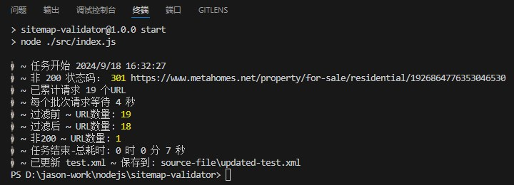

# Node.js 项目案例

需求：删除 sitemap.xml 中状态为非200的URL链接 （sitemap.xml 中有 49000 个 URL）

-	使用 Node.js 读取并解析 XML 内容，提取出所有链接
-	对每个链接发起 HTTP 请求，检查其响应状态码
-	根据响应状态码，移除那些状态码不是 200 的链接

## 1. 初始化项目

在新创建的目录中初始化一个新的 Node.js 项目。这将创建一个 package.json 文件，用于记录项目的元数据以及依赖关系。

```bash
npm init -y
```

-y 是一个选项，表示“yes”或“同意所有默认值”。当你运行 npm init -y 时，它会自动为你创建一个 package.json 文件，并使用一组默认值填充这个文件。

```json
{
  "name": "demo",
  "version": "1.0.0",
  "description": "",
  "type": "module", // 手动配置
  "main": "index.js",
  "scripts": {
    "test": "echo \"Error: no test specified\" && exit 1"
  },
  "keywords": [],
  "author": "",
  "license": "ISC"
}
```
在 package.json 加入 "type": "module" 

"type": "module" 会使得 Node.js 将该目录下的所有 .js 文件视为 ES 模块（ESM），而不是传统的 CommonJS 模块。

这意味着你可以直接在 .js 文件中使用 import 和 export 语句，而不需要将文件扩展名为 .mjs

## 2. 安装必要的依赖

安装必要的依赖包。我们需要安装 delay、p-limit、xml2js

```bash
npm i delay p-limit xml2js
```

xml2js 用于将 XML 数据转换为 JavaScript 对象，并且可以从 JavaScript 对象生成 XML 文档。

p-limit 用于控制并发执行的任务数量。它可以用来限制并行执行的 Promise 数量，从而避免过多的并发操作可能导致的问题，如资源消耗过大、系统不稳定等。

delay 用于异步等待一段时间，然后再继续执行后续的代码。

## 3. 编写代码

#### 1. 新建 utils/httpRequest.js，封装原生 HTTP 请求 （使用 axios 请求始终返回 200 状态码）

```js

import http from 'http'
import https from 'https'

/**
 * 发起 HTTP/HTTPS 请求(Node.js 原生请求)
 * @param {string} url - 请求的 URL
 * @param {object} options - 请求选项
 * @param {object} [options.headers] - 请求头
 * @param {number} [options.timeout] - 请求超时时间（毫秒）
 * @param {string} [options.method] - 请求方法（GET、POST等）
 * @param {string|object} [options.body] - 请求体
 * @returns {Promise} - 请求的 Promise，解析为响应对象
*/
function httpRequest(url, options = {}) {
  return new Promise((resolve, reject) => {
    // 解析 URL
    const parsedUrl = new URL(url)

    /** 
     * 解析 URL
     * {
        href: 'https://www.metahomes.net/property/for-sale/residential/1826864775694540802',
        origin: 'https://www.metahomes.net',
        protocol: 'https:',
        username: '',
        password: '',
        host: 'www.metahomes.net',
        hostname: 'www.metahomes.net',
        port: '',
        pathname: '/property/for-sale/residential/1826864775694540802',
        search: '',
        searchParams: URLSearchParams {},
        hash: ''
      }
     */

    // 设置请求选项
    const requestOptions = {
      method: options.method || 'GET',
      hostname: parsedUrl.hostname,
      path: parsedUrl.pathname + (parsedUrl.search || ''),
      port: parsedUrl.protocol === 'https:' ? 443 : 80,
      headers: options.headers || {},
      timeout: options.timeout || 10000 // 默认超时时间 10 秒
    }
    
    // 请求协议
    const requestModule = parsedUrl.protocol === 'https:' ? https : http

    // 发起请求
    const req = requestModule.request(requestOptions, res => {
      let data = ''

      res.on('data', chunk => {
        data += chunk // 将每个数据块累积到 data 中
      })

      res.on('end', () => {
        resolve({
          statusCode: res.statusCode,
          headers: res.headers,
          data
        })
      })
    })

    // 处理请求错误
    req.on('error', err => {
      reject(err)
    })

    // 处理请求超时
    req.on('timeout', () => {
      req.destroy(new Error('请求超时'))
    })

    // 写入请求体
    if (options.body) {
      req.write(typeof options.body === 'object' ? JSON.stringify(options.body) : options.body)
    }

    // 结束请求
    req.end()
  })
}

export default httpRequest

```

#### 2. 新建 src/UpdatedSitemap.js，编写核心逻辑

```js
// fs 是 Node.js 中的一个内置模块，用于处理文件系统操作。fs 模块提供了很多方法来读取、写入、更新、删除文件以及目录等。
import fs from 'fs'
// path 是 Node.js 中的一个核心模块，它提供了对路径名进行操作的功能。path 模块主要用于处理文件和目录路径字符串。
import path from 'path'
// pLimit 用于控制并发执行的任务数量
import pLimit from 'p-limit'
// xml2js 用于读取 xml，写入 xml
import { parseString, Builder } from 'xml2js'
// 延迟，等待
import delay from 'delay'
// 事件派发器
import EventDispatcher from './utils/eventDispatcher.js'
// 封装 Http 请求方法
import httpRequest from './utils/httpRequest.js'

class UpdatedSitemap extends EventDispatcher {
  constructor(options) {
    super()

    const {
      sitemapFilePath, // 源文件路径
      batchSize = 100, // 每批请求的 URL 数量
      maxConcurrency = 20, // 最大并发数
      requestInterval = 3000 // 请求之间的间隔时间（毫秒）
    } = options

    // 必传选项
    if (!sitemapFilePath) {
      throw new Error('请配置源文件路径')
    }

    this.sitemapFilePath = sitemapFilePath
    this.batchSize = batchSize
    this.maxConcurrency = maxConcurrency
    this.requestInterval = requestInterval

    this.init()
  }

  // 读取 sitemap.xml 文件
  readSitemap(path) {
    return new Promise((resolve, reject) => {
      fs.readFile(path, 'utf8', (err, data) => {
        if (err) {
          reject(err)
        }
        resolve(data)
      })
    })
  }

  // 解析 sitemap.xml 文件
  parseSitemap(xml) {
    return new Promise((resolve, reject) => {
      parseString(xml, (err, result) => {
        if (err) {
          reject(err)
        }
        resolve(result)
      })
    })
  }

  // 请求 URL 并检查状态码
  async checkUrl(url) {
    try {
      // 使用 axios 返回的状态码全是 200，这里改用 Node.js 原生方式
      const res = await httpRequest(url)
      if (res.statusCode !== 200) {
        console.log('🚀 ~ 非 200 状态码：', res.statusCode, url)
      }
      return res.statusCode
    } catch (error) {
      console.log('🚀 ~ 请求错误：', error)
      return null
    }
  }

  // 检查所有URL
  async checkAllUrls(urls) {
    // batchSize = 100 // 每批请求的 URL 数量
    // maxConcurrency = 20 // 最大并发数
    // requestInterval = 3000 // 请求之间的间隔时间（毫秒）

    // 设置并发量
    const limit = pLimit(this.maxConcurrency)
    const allResults = []

    // 分批处理 URL
    for (let i = 0; i < urls.length; i += this.batchSize) {
      // 每个批次请求的集合
      const batch = urls.slice(i, i + this.batchSize)

      // 等待一个批次中的所有 URL 请求完成
      const batchResults = await Promise.all(
        batch.map(url => {
          // 控制并发，确保同一时间最多只有 xx 个任务在执行
          return limit(() => this.checkUrl(url))
        })
      )

      allResults.push(...batchResults)

      // 添加延迟，每个批次之间设置请求间隔
      await delay(this.requestInterval)
    }

    return allResults
  }

  // 主处理函数
  async init() {
    // 读取、解析 xml
    const xml = await this.readSitemap(this.sitemapFilePath)
    const sitemap = await this.parseSitemap(xml)

    // 获取所有 url
    const urls = sitemap.urlset.url.map(url => url.loc[0])

    // 触发开始事件
    this.dispatchEvent('start')

    // 获取所有 URL 的状态
    const statuses = await this.checkAllUrls(urls)

    // filter 过滤，保留状态码为 200 的 URL
    const newUrls = urls.filter((url, index) => statuses[index] === 200)

    // 更新 sitemap
    sitemap.urlset.url = newUrls.map(url => ({
      loc: [url]
    }))

    // 生成新的 xml 字符串
    const builder = new Builder()
    const newXml = builder.buildObject(sitemap)

    // 获取目录部分
    const directory = path.dirname(this.sitemapFilePath)

    // 提取文件名部分
    const fileName = path.basename(this.sitemapFilePath)

    const newSitemapPath = path.join(directory, `updated-${fileName}`)

    // 写文件
    fs.writeFile(newSitemapPath, newXml, err => {
      if (err) {
        throw err
      }
      this.dispatchEvent('end') // 触发结束事件
    })
  }
}

export default UpdatedSitemap
```

#### 3. 新建 src/index.js 作为主入口文件。

```js
// 导入核心类
import UpdatedSitemap from './UpdatedSitemap.js'
// 打印时间、耗时
import { printElapsedTime, formatTime } from './utils/common.js'
// 将 console.log() 日志写入文件，并且保留 console.log() 原始功能
import logger from './utils/logger.js'

// 初始化日志记录器
logger.setupLogger('./source-file/test.xml.log')

// 源文件路径
const sitemapFilePath = './source-file/test.xml'

const u = new UpdatedSitemap({
  sitemapFilePath, // 源文件路径
  batchSize: 100, // 每批请求的 URL 数量
  maxConcurrency: 20, // 最大并发数
  requestInterval: 4000 // 请求之间的间隔时间4秒 (测试结果间隔必须在3秒以上，否则服务器 CPU 警告)
})

// 下面代码打印时间：开始、结束、耗时
let intervalId = null
let startTime = null

u.addEventListener('start', () => {
  startTime = Date.now()
  console.log('🚀 ~ 任务开始', new Date().toLocaleString())
  // 每隔 1 分钟打印一次时间和耗时
  intervalId = setInterval(printElapsedTime, 60000)
})

u.addEventListener('end', () => {
  // 停止打印运行时间
  clearInterval(intervalId)
  const currentTime = Date.now()
  const elapsedTime = currentTime - startTime
  console.log('🚀 ~ 任务结束-总耗时:', formatTime(elapsedTime))

  const directory = path.dirname(sitemapFilePath) // 获取目录部分
  const fileName = path.basename(sitemapFilePath) // 提取文件名部分
  console.log(`🚀 ~ 已更新 ${fileName} ~ 保存到:`, path.join(directory, `updated-${fileName}`))
})
```

## 4. 配置构建命令

package.json

```json
"scripts": {
  "start": "node ./src/index.js"
},
```

## 5. 运行 npm start ，等待 xml 文件更新。

