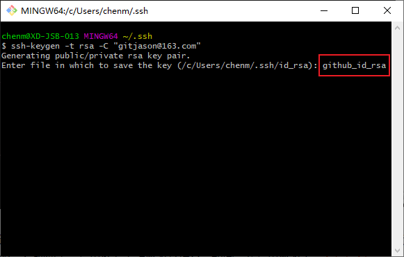

# 配置多个 SSH key

一般来说，一台电脑默认只有一个私钥 id_rsa  和公钥 id_rsa.pub 。当我们需要在一台电脑上操作不同的 git 账号（或 gitlab、gitee、github）就需要多个对应的ssh key，因为一个 git 账号只能建一个与账号名相同的仓库。

## ssh是什么？
ssh是Secure Shell（安全外壳协议）的缩写，建立在应用层和传输层基础上的安全协议。为了便于访问github，要生成ssh公钥，这样就不用每一次访问github都要输入用户名和密码。简单来说就是方便我们拉取推送代码。

## 生成条件
1.本地安装 Git ，未安装用户可以点击 [Git官网](https://git-scm.com/) 进行下载  
2.注册需要配置 ssh 平台的账号（Github，Gitee，Gitlab，Coding）

## 生成步骤
- 检查系统是否有.ssh文件夹  

windows系统下一般是在 C:\Users\Administrator 目录下，如果没有手动新建 .ssh 文件夹。


- 生成多个ssh key

进入 .ssh 目录下，单机鼠标右键，选择 Git Bash here，打开 git bash：


### 1. 创建SSH Key

输入命令：
```sh
ssh-keygen -t rsa -C "主邮箱"
```
引号中的内容是你在 github 上注册所使用的主邮箱，点击确定。


这里需要注意，该命令会默认生成为 id_rsa 的公钥和 id_rsa.pub 的私钥文件。为了防止后续生成别的 ssh 被覆盖，这里推荐手动修改文件名。如图，我这里修改为 github_id_rsa



继续回车确定，会提示你设置密码和再次输入密码。为了简化操作，这里不建议设置密码，直接回车确定。


再次回车确定，看到如下样式，就说明 ssh 生成成功了，在 .ssh 文件夹会下看到 github_id_rsa 文件和 github_id_rsa.pub 文件。  
id_rsa是私钥，不能泄露出去，id_rsa.pub是公钥，可以放心地告诉任何人。


### 2. 登录github，添加 SSH Key
- 登录 github，点击 右上角头像 ---> Setttings --> SSH and GPG keys --> New SSH keys 
- 打开生成的 github_id_rsa.pub 文件，全选并复制内容
- Titile 输入备注， Key 中粘贴上刚刚拷贝的公钥
- 点击 Add SSH Key，成功


- 验证你是否已经成功配置了 SSH 密钥： 
```sh
ssh -T git@github.com
```
出现如下字样就是设置成功了


完成以上步骤就生成配置好了 github 的 ssh key，可以使用 ssh 方式克隆或者推送代码到 github 远程仓库。gitee 或 gitlab 或 coding 的生成方法也是如此，重复以上步骤即可。

重复以上步骤后，在文件目录下会看到生成了多个 ssh key ，分别对应不同的代码托管平台。如图：


### 3. 配置 config 文件

在.ssh文件夹中手动创建config文件或者输入命令touch config生成，并按下面的模板填写，该文件用于配置私钥对应的服务器。
```sh
# gitlab
Host gitlab.com
HostName gitlab.com
PreferredAuthentications publickey
IdentityFile ~/.ssh/gitlab_id_rsa

# gitee
Host gitee.com
HostName gitee.com
PreferredAuthentications publickey
IdentityFile ~/.ssh/gitee_id_rsa

# github
Host github.com
HostName github.com
PreferredAuthentications publickey
IdentityFile ~/.ssh/github_id_rsa
```

配置说明：

- Host：自定义别名，会影响git相关命令
- HostName：真实的服务器地址（域名）
- User：之前配置的用户名可以省略（xxx@xxx.com）
- PreferredAuthentications：权限认证（publickey,password publickey,keyboard-interactive）一般直接设为publickey
- IdentityFile：rsa文件地址

以上就是在同一电脑上配置多个 ssh key 的所有步骤了。
